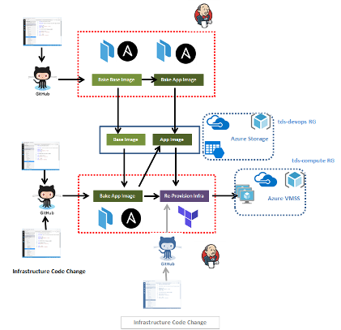

# compute-engine-vmss-cicd

Automated source code to infrastructure deployment CI/CD pipelines for 
[compute-engine-vmss](https://github.com/amolthacker/azure-poc-compute-engine-vmss).

## Pipelines

 * Bake Images
 * Deploy [autoscaling compute-engine](https://github.com/amolthacker/azure-poc-compute-engine-vmss)

## Next steps

 * Blue-green deployments
 * Store terraform state in Azure / etcd
 * Separate out repos for infra and config management / provisioning code
 * Integrate two pipelines with branches for handling different deployment/provisioning state scenarios
 * Jenkins in master-agent mode with build agents in VMSS

